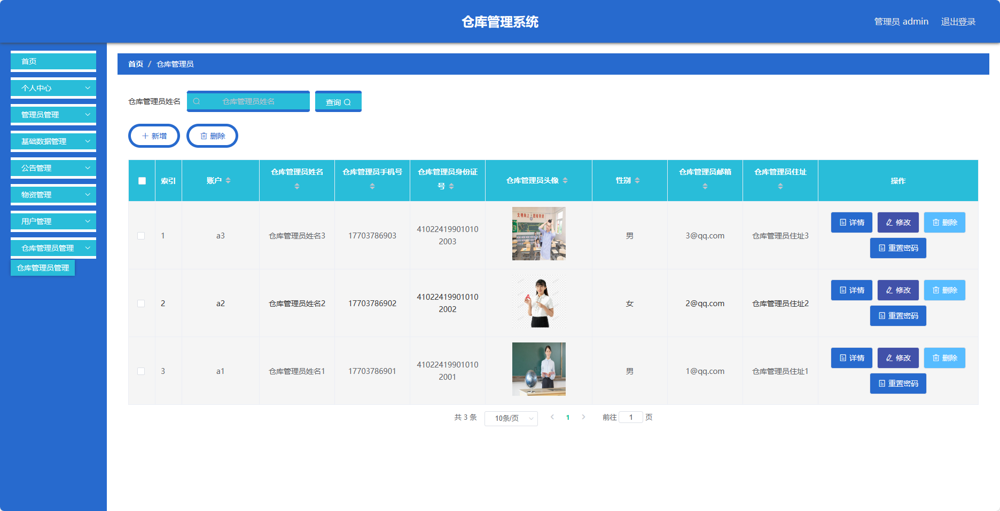

基于SpringBoot的仓库管理系统（程序+论文）
=
- 完整代码获取地址：从戎源码网 ([https://armycodes.com/](https://armycodes.com/))
- 作者微信：19941326836  QQ：952045282 
- 承接计算机毕业设计、Java毕业设计、Python毕业设计、深度学习、机器学习
- 选题+开题报告+任务书+程序定制+安装调试+论文+答辩ppt 一条龙服务

一、项目介绍
---
基于Spring Boot框架实现的仓库管理系统，系统包含三种角色：管理员、仓库管理员，用户,主要功能如下。
【管理员】：
- 个人中心：管理员可以查看和编辑个人信息。
- 管理员管理：管理员可以对其他管理员进行管理，包括添加、编辑和删除管理员账号。
- 基础数据管理：管理员可以管理系统的基础数据，包括分类、标签等信息的添加、编辑和删除。
- 公告管理：管理员可以发布和管理系统的公告信息，包括添加、编辑和删除公告。
- 物资管理：管理员可以管理系统的物资信息。
- 用户管理：管理员可以管理用户账号，包括查看用户信息、禁用用户账号等操作。
- 仓库管理员管理：管理员可以分配和管理仓库管理员的权限和职责。

【仓库管理员】：
- 个人中心：仓库管理员可以查看和编辑个人信息。
- 公告管理：仓库管理员可以发布和管理仓库的公告信息，包括添加、编辑和删除公告。
- 物资管理：仓库管理员可以管理仓库的物资信息，包括物资的添加、编辑和删除，以及库存管理和报损处理。
- 物资申请管理：仓库管理员可以处理用户对物资的申请。

【用户】：
- 个人中心：用户可以查看和编辑个人信息。
- 公告管理：用户可以查看系统和仓库发布的公告信息。
- 物资管理：用户可以浏览和搜索系统和仓库的物资信息。
- 物资申请管理：用户可以申请借用系统和仓库的物资。

二、项目技术
---
- 编程语言：Java
- 数据库：MySQL
- 项目管理工具：Maven
- 前端技术：VUE、js、css
- 后端技术：Spring、SpringMVC、MyBatis

三、运行环境
---
- 操作系统：Windows、macOS都可以
- JDK版本：JDK1.8以上都可以
- 开发工具：IDEA、Ecplise、Myecplise都可以
- 数据库: MySQL5.7以上都可以
- Tomcat：任意版本都可以
- Maven：任意版本都可以

四、运行截图
---
### 论文截图：

### 程序截图：

